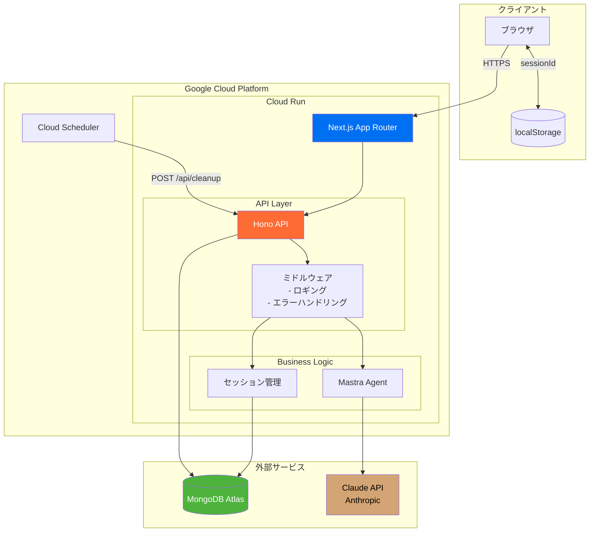
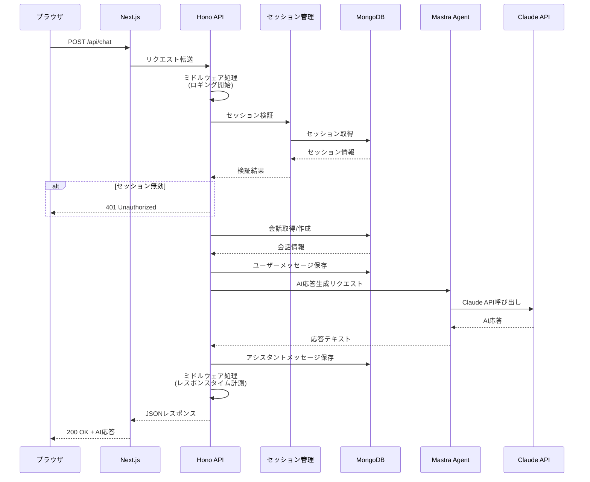
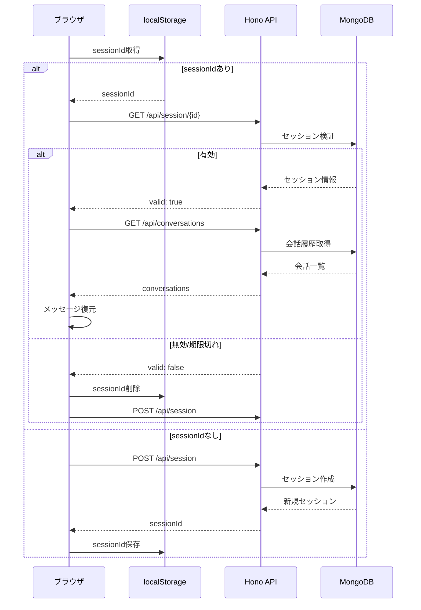
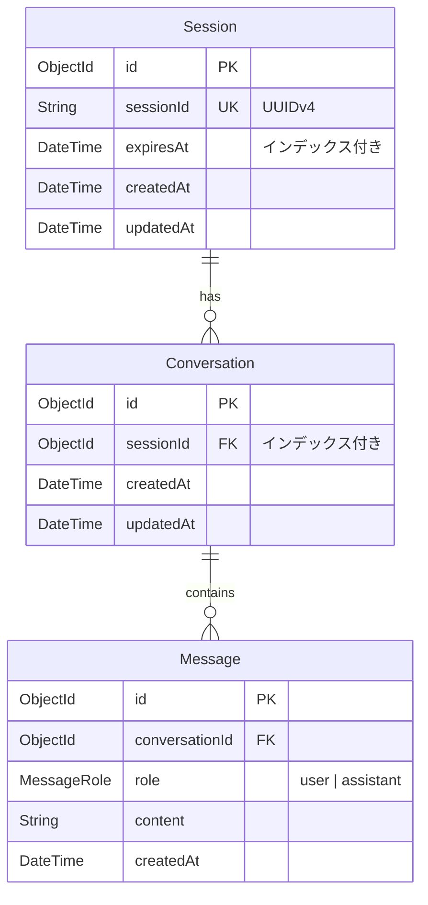
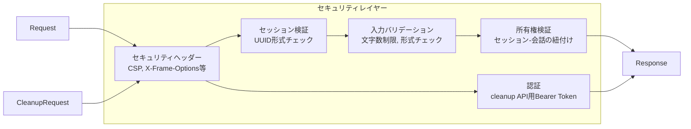

# AIチャット アーキテクチャ図

## 1. システム構成図



## 2. リクエストフロー図

### 2.1 チャットメッセージ送信フロー



### 2.2 セッション初期化フロー



## 3. データモデル図



## 4. ディレクトリ構成

```
ai-chat/
├── CLAUDE.md                 # プロジェクト仕様書
├── TODO.md                   # 実装計画
├── README.md                 # セットアップ手順
├── docs/                     # ドキュメント
│   ├── architecture.md       # 本ファイル
│   └── api-documentation-plan.md
│
└── app/                      # Next.jsアプリケーション
    ├── src/
    │   ├── app/              # Next.js App Router
    │   │   ├── api/[[...route]]/  # Hono APIルート
    │   │   ├── layout.tsx    # ルートレイアウト
    │   │   └── page.tsx      # メインページ
    │   │
    │   ├── components/       # Reactコンポーネント
    │   │   ├── chat/         # チャット関連
    │   │   │   ├── ChatContainer.tsx
    │   │   │   ├── ChatInput.tsx
    │   │   │   ├── MessageList.tsx
    │   │   │   └── MessageItem.tsx
    │   │   └── ui/           # 共通UI
    │   │
    │   └── lib/              # ライブラリ・ユーティリティ
    │       ├── api/          # APIクライアント・Honoアプリ
    │       │   ├── app.ts    # Honoアプリ定義
    │       │   ├── chat.ts   # フロントエンド用APIクライアント
    │       │   ├── errors.ts # エラーコード定義
    │       │   └── middleware/  # ミドルウェア
    │       ├── db/           # Prisma関連
    │       ├── logger/       # 構造化ログ
    │       ├── mastra/       # Mastra Agent設定
    │       ├── session/      # セッション管理
    │       └── storage/      # localStorage操作
    │
    ├── tests/                # テストファイル
    │   ├── unit/             # 単体テスト (Vitest)
    │   └── e2e/              # E2Eテスト (Playwright)
    │
    ├── prisma/
    │   └── schema.prisma     # データベーススキーマ
    │
    ├── scripts/
    │   └── deploy.sh         # デプロイスクリプト
    │
    ├── Dockerfile            # 本番用Dockerイメージ
    ├── docker-compose.yml    # ローカル開発用
    └── cloudbuild.yaml       # Cloud Build設定
```

## 5. 技術スタック

| レイヤー | 技術 | 用途 |
|----------|------|------|
| フロントエンド | Next.js 16 (App Router) | SSR/CSRフレームワーク |
| | React 19 | UIライブラリ |
| | Tailwind CSS | スタイリング |
| | TypeScript | 型安全性 |
| バックエンド | Hono | 軽量APIフレームワーク |
| | Mastra | AIエージェントフレームワーク |
| | Prisma 6 | ORM |
| データベース | MongoDB 7 | ドキュメントDB |
| AI | Claude claude-sonnet-4-20250514 | LLM |
| インフラ | Google Cloud Run | サーバーレスコンテナ |
| | Cloud Scheduler | 定期実行 |
| | Docker | コンテナ化 |
| テスト | Vitest | 単体テスト |
| | Playwright | E2Eテスト |

## 6. セキュリティ



| 対策 | 実装 |
|------|------|
| XSS防止 | CSP, X-Content-Type-Options |
| クリックジャッキング防止 | X-Frame-Options |
| セッションハイジャック対策 | UUIDv4による推測困難なID |
| 入力検証 | 最大文字数制限、形式チェック |
| 認可 | セッション所有権の検証 |
